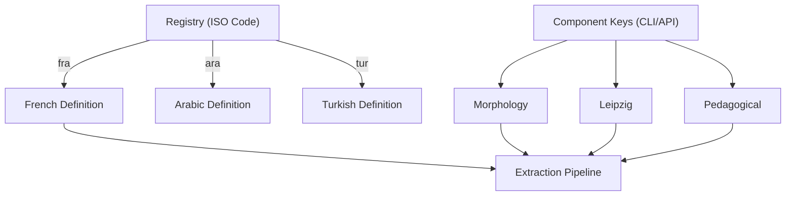
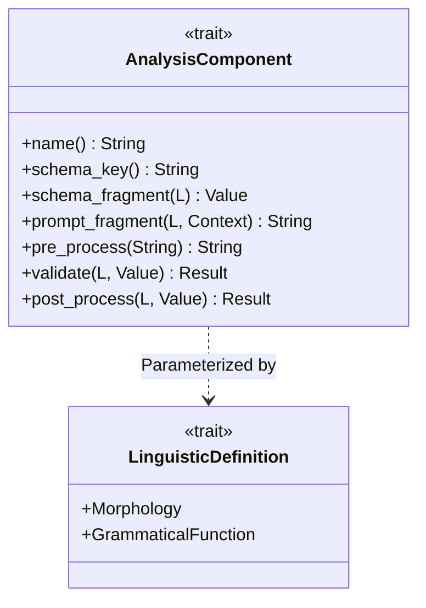
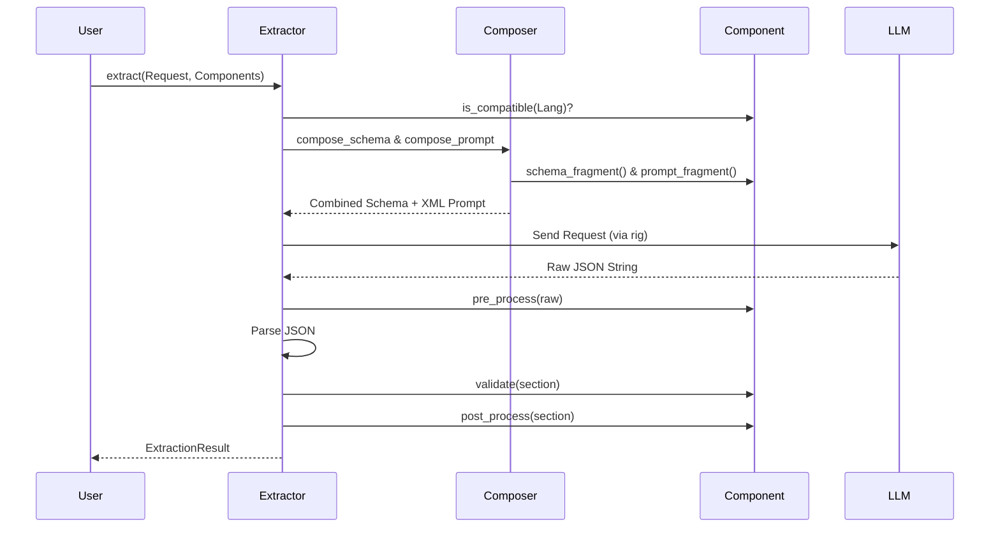
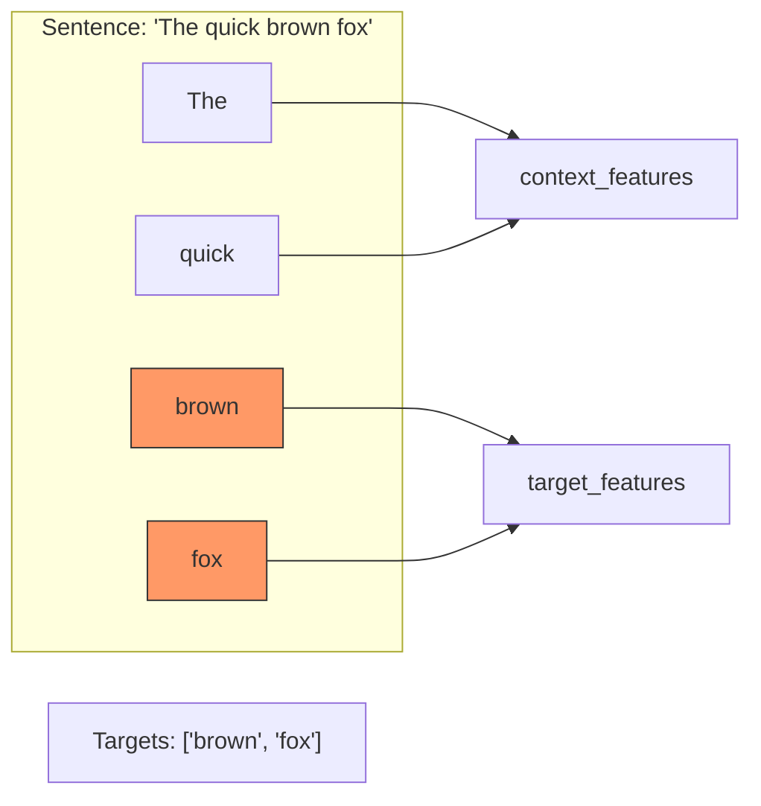
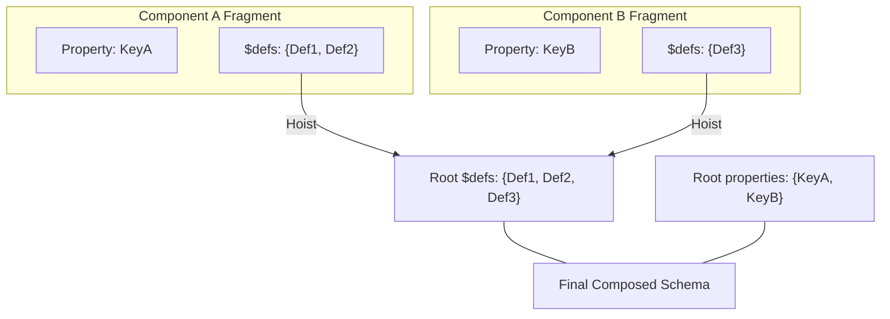

# Panini Analysis Component System: Developer Guide

This document provides technical details and concrete examples for developers who want to extend or modify the analysis component logic. It covers the trait, lifecycle, orchestration, and extension scenarios.

---

## 1. File Map: Where to find things

| Concept                 | Location                            | Purpose                                                                                     |
| :---------------------- | :---------------------------------- | :------------------------------------------------------------------------------------------ |
| **Trait Definition**    | `panini-core/src/component.rs`      | The `AnalysisComponent` trait and `ExtractionResult` container.                             |
| **Standard Components** | `panini-core/src/components/`       | Built-in implementations (`morphology.rs`, `leipzig.rs`, `morpheme_segmentation.rs`, etc.). |
| **Pipeline Logic**      | `panini-engine/src/extractor.rs`    | Orchestration of the composable extraction pipeline.                                        |
| **Schema Composition**  | `panini-engine/src/composer.rs`     | Merging JSON schemas and XML-tagged prompt fragments.                                       |
| **Registry Dispatch**   | `panini-langs/src/registry.rs`      | Mapping string keys to component instances and ISO codes to languages.                      |
| **Typed Results**       | `panini-macro/src/panini_result.rs` | The `#[derive(PaniniResult)]` macro logic.                                                  |




---

## 2. The `AnalysisComponent` Trait

Every analysis unit must implement `AnalysisComponent<L: LinguisticDefinition>`. This trait defines how a component contributes to the extraction pipeline.




```rust
pub trait AnalysisComponent<L: LinguisticDefinition>: Send + Sync + Debug {
    /// Human-readable name for logging.
    fn name(&self) -> &'static str;

    /// The top-level JSON key this component produces (e.g., "morphology").
    fn schema_key(&self) -> &'static str;

    /// Returns the JSON Schema fragment for this component's output.
    /// Hoisted by the composer into the global schema.
    fn schema_fragment(&self, lang: &L) -> serde_json::Value;

    /// Returns prompt instructions for the LLM.
    /// Wrapped in XML tags by the composer.
    fn prompt_fragment(&self, lang: &L, ctx: &ComponentContext) -> String;

    /// Optional rules appended to the output guidelines section.
    fn output_instruction(&self) -> Option<&str> { None }

    // --- Lifecycle Hooks ---
    
    /// Pre-process the raw LLM JSON text before it is parsed.
    fn pre_process(&self, raw: &str) -> String { raw.to_string() }

    /// Validate the component's section of the parsed JSON object.
    fn validate(&self, _lang: &L, _section: &serde_json::Value) -> Result<(), String> { Ok(()) }

    /// Mutate the component's section after parsing (e.g., for data enrichment).
    fn post_process(&self, _lang: &L, _section: &mut serde_json::Value) -> Result<(), String> { Ok(()) }

    /// Filter: Is this component compatible with the current language?
    fn is_compatible(&self, _lang: &L) -> bool { true }
}
```

---

## 3. High-Level Lifecycle: The Pipeline

When `extract_with_components` is executed:



1.  **Filtering**: components are skipped if `is_compatible(lang)` is false.
2.  **Schema Hooking**: `compose_schema` iterates over components, extracting `$defs` and merging fragments into a master object.
3.  **Prompt Tagging**: `compose_prompt` wraps each fragment in XML tags like `<morphology>...</morphology>` for clear instruction isolation.
4.  **LLM Call**: The composed system prompt and master schema are sent to the model.
5.  **Chain Pre-processing**: The raw response string is passed through `pre_process()` of all active components sequentially.
6.  **Parse & Validate**:
    *   Syntactic parsing into JSON.
    *   Semantic validation via per-component `validate()`.
7.  **Post-processing**: The JSON object is mutated in-place by `post_process()`.


---

## 4. Scenario: Adding a New Component

If you want to add a component that detects "Sentence Complexity" or "CEFR Level":

### Step A: Define the Output Structure
In `panini-core/src/components/complexity.rs` (or your component file):
```rust
use serde::{Deserialize, Serialize};
use schemars::JsonSchema;

#[derive(Debug, Serialize, Deserialize, JsonSchema)]
pub struct ComplexityResult {
    pub level: CefrLevel,
    pub reasoning: String,
    pub word_count: usize,
}

#[derive(Debug, Serialize, Deserialize, JsonSchema)]
pub enum CefrLevel { A1, A2, B1, B2, C1, C2 }
```

### Step B: Implement the Trait
```rust
#[derive(Debug, Default)]
pub struct ComplexityAnalysis;

impl<L: LinguisticDefinition> AnalysisComponent<L> for ComplexityAnalysis {
    fn name(&self) -> &'static str { "Sentence Complexity" }
    fn schema_key(&self) -> &'static str { "complexity" }

    fn schema_fragment(&self, _lang: &L) -> serde_json::Value {
        // Use schemars for robust schema generation
        let gen = schemars::SchemaGenerator::default();
        let schema = gen.into_root_schema_for::<ComplexityResult>();
        serde_json::to_value(&schema).unwrap()
    }

    fn prompt_fragment(&self, _lang: &L, ctx: &ComponentContext) -> String {
        format!(
            "Analyze the sentence grammar and vocabulary complexity.\n\
             Explain your reasoning in {}, identifying difficult structures.",
            ctx.learner_ui_language
        )
    }

    fn post_process(&self, _lang: &L, section: &mut serde_json::Value) -> Result<(), String> {
        // Example: Force lowercase on reasoning for normalization
        if let Some(reasoning) = section.get_mut("reasoning").and_then(|v| v.as_str()) {
             let normalized = reasoning.trim().to_lowercase();
             *section.get_mut("reasoning").unwrap() = serde_json::json!(normalized);
        }
        Ok(())
    }
}
```

### Step C: Register the Component
In `panini-langs/src/registry.rs`, add it to the `all_components` vector:
```rust
let all_components: Vec<(&str, &dyn AnalysisComponent<L>)> = vec![
    ("complexity", &ComplexityAnalysis),
    // ...
];
```

---

## 5. Scenario: Creating a Typed Result Struct

The `#[derive(PaniniResult)]` macro is the recommended way to consume extraction results. It maps component keys to struct fields automatically.

```rust
#[derive(PaniniResult)]
pub struct FullExtraction<L: LinguisticDefinition> {
    // Required component logic
    #[component(MorphologyAnalysis)]
    pub morphology: MorphologyResult<L::Morphology>,
    
    // Optional component: maps to None if the component was skipped or missing
    #[component(MorphemeSegmentation)]
    pub segmentation: Option<Vec<WordSegmentation<L::GrammaticalFunction>>>,

    #[component(PedagogicalExplanation)]
    pub explanation: String,
}
```

---

## 6. Accessing Results

### Using the Typed Struct (Recommended)
```rust
let result: FullExtraction<Arabic> = FullExtraction::extract(
    &arabic_lang, 
    &gpt4_model, 
    &request, 
    options
).await?;

println!("Lemma: {}", result.morphology.target_features[0].lemma);
```

### Manual Handling (No Macro)
If you prefer dynamic access via `ExtractionResult`:
```rust
let raw_result: ExtractionResult = extract_with_components(
    &lang, &model, &req, &[&MorphologyAnalysis, &LeipzigAlignment], opts
).await?;

// Key-based typed access
let morphology: MorphologyResult<L::Morphology> = raw_result.get("morphology")?;

// Iterating over all present keys
for (key, value) in raw_result.iter_raw() {
    println!("Component '{}' returned: {}", key, value);
}
```

---

## 7. Common Component Patterns

### The "Target / Context" Pattern
Most linguistic components in Panini (like `MorphologyAnalysis`) follow a split-output pattern to distinguish the words the user is focusing on from the rest of the sentence.

```rust
#[derive(Debug, Serialize, Deserialize, JsonSchema)]
pub struct SplitResult<T> {
    /// Features for words explicitly requested in `ExtractionRequest::targets`.
    pub target_features: Vec<T>,
    /// Features for all other words in the sentence (for context).
    pub context_features: Vec<T>,
}
```



Using this pattern in your custom components ensures consistency with the core framework and simplifies UI rendering (e.g., highlighting target words).


> [!IMPORTANT]
> **Compile-time Safety**
> The `#[derive(PaniniResult)]` macro enforces compatibility. If `MorphemeSegmentation` requires `Agglutinative` languages, using it in a `FullExtraction<French>` struct will result in a **compile-time error**, preventing impossible extractions before they happen.

---

## 6. Implementation Notes: XML Tagging & Defs Hoisting

> [!TIP]
> **Prompt Isolation**
> XML tagging (e.g., `<morpheme_segmentation>`) is used during prompt composition to help the LLM understand which instructions apply to which JSON key, significantly improving extraction accuracy for complex schemas.

### \$defs Hoisting



> [!WARNING]
> **Schema \$defs Hoisting**
> The `composer.rs` automatically hoists `$defs` maps from individual component fragments to the root of the composed schema. This is critical for schema validation to work because `$ref` paths must resolve from the root level.

