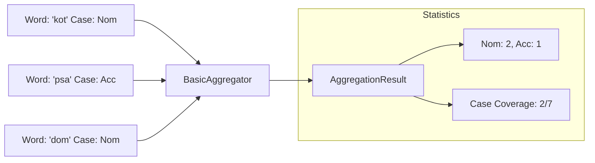

# Aggregation & Statistics

The Pāṇini aggregation system allows you to transform atomic extractions (e.g., analyzed sentences) into global insights about a text corpus or a learner profile.

---

## 1. Role and Concept

The goal of aggregation is to answer questions like:

- **"What are the most frequent grammatical cases in this text?"**
- **"What is the coverage rate of Polish morphological features in this corpus?"**
- **"What are the most used verb lemmas?"**

The system relies on two types of data:

1. **Distributions (Closed Sets)**: Used for enums (e.g., Case, Gender). They allow calculating **Coverage** (e.g., "I've seen 4 out of 7 possible cases").
2. **Inventories (Open Sets)**: Used for free strings (e.g., Lemmas, Roots). They allow counting unique occurrences.

---

## 2. Usage: The Aggregable Pipeline

To be aggregated, an object must implement the `Aggregable` trait. This is automatic for morphology enums derived with `#[derive(MorphologyInfo)]`.



---

## 3. The AggregationResult Object

The `AggregationResult` is the final product of an aggregation. It contains data grouped by categories (e.g., "Noun", "Verb", "morpheme").

### Example Console Output:
```text
[NOUN] total: 15
  |- case [3/7]: nominative(8), accusative(5), genitive(2)
  |- gender [2/3]: feminine(10), masculine(5)
  |- lemma [8 unique]: studentka(3), biblioteka(2)...
```

### Programmatic Access (Rust)
```rust
let result: AggregationResult = features.into_iter().collect();

println!("Total items: {}", result.total_count());
println!("Group count: {}", result.group_count());

// Access a specific group
if let Some(noun_stats) = result.by_group.get("Noun") {
    // Analyze dimensions...
}
```

---

## 4. Technical Importance: Closed Sets

!!! info "Why use ClosedValues?"
    For a dimension (e.g., Case) to calculate its coverage rate, it must know the exhaustive list of possibilities. This is the role of `#[derive(ClosedValues)]` on your linguistic enums. Without it, the system treats data as a simple inventory without any notion of completion percentage.
