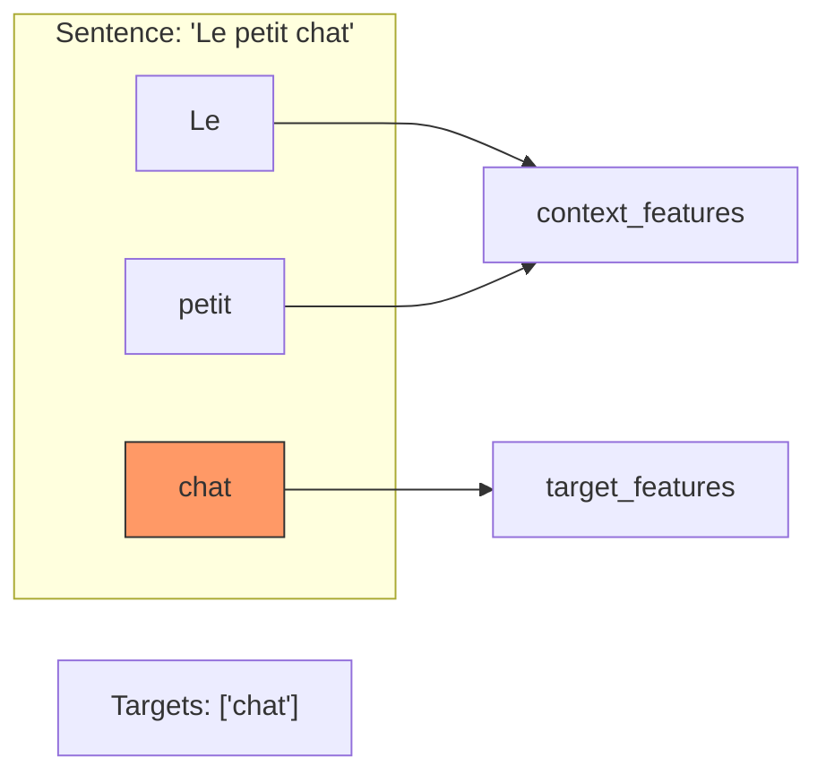

# Creating an Analysis Component

If you'd like to extend Panini with a new analysis axis (e.g., CEFR level, sentiment, etc.), you must implement the `AnalysisComponent` trait.

---

## 🔧 Steps to Create a Component

### 1. Define the Output Structure
In `panini-core/src/components/complexity.rs` (or your component file):

```rust
use serde::{Deserialize, Serialize};
use schemars::JsonSchema;

#[derive(Debug, Serialize, Deserialize, JsonSchema)]
pub struct ComplexityResult {
    pub level: CefrLevel,
    pub reasoning: String,
}

#[derive(Debug, Serialize, Deserialize, JsonSchema)]
pub enum CefrLevel { A1, A2, B1, B2, C1, C2 }
```

### 2. Implement the AnalysisComponent Trait
The `AnalysisComponent` trait is generic over the linguistic definition `L`.

```rust
#[derive(Debug, Default)]
pub struct ComplexityAnalysis;

impl<L: LinguisticDefinition> AnalysisComponent<L> for ComplexityAnalysis {
    fn name(&self) -> &'static str { "Complexity Analysis" }
    fn schema_key(&self) -> &'static str { "complexity" }

    fn schema_fragment(&self, _lang: &L) -> serde_json::Value {
        // Use schemars to generate the JSON schema
        let gen = schemars::SchemaGenerator::default();
        let schema = gen.into_root_schema_for::<ComplexityResult>();
        serde_json::to_value(&schema).unwrap()
    }

    fn prompt_fragment(&self, _lang: &L, ctx: &ComponentContext) -> String {
        format!(
            "Analyze the grammar and vocabulary of the sentence to determine its CEFR level.\n\
             Explain your reasoning in {}, identifying difficult structures.",
            ctx.learner_ui_language
        )
    }

    fn is_compatible(&self, _lang: &L) -> bool {
        true // All languages support complexity analysis
    }
}
```

### 3. Register the Component
In `panini-langs/src/registry.rs`, add it to the `all_components` vector in the `extract_for_language` function:

```rust
let all_components: Vec<(&str, &dyn AnalysisComponent<L>)> = vec![
    ("morphology", &morphology_comp),
    ("complexity", &ComplexityAnalysis::default()), // Your new component
];
```

---

## 🏗 Recommended Patterns

### Target Word vs. Context
Most linguistic components (like `MorphologyAnalysis`) follow the `SplitResult` pattern to distinguish the user's focus words from the rest of the sentence.

```rust
#[derive(Debug, Serialize, Deserialize, JsonSchema)]
pub struct SplitResult<T> {
    pub target_features: Vec<T>,
    pub context_features: Vec<T>,
}
```



Using this pattern ensures consistency across the framework and simplifies UI rendering (e.g., highlighting target words).
