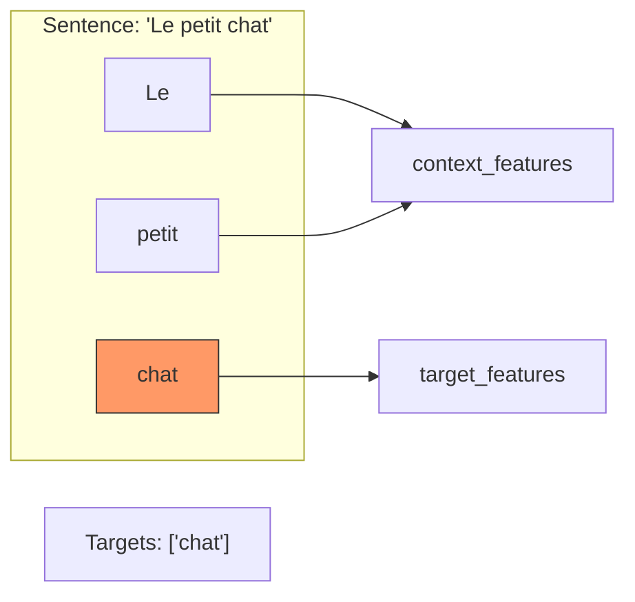

# Creating an Analysis Component

If you'd like to extend Panini with a new analysis axis (e.g., CEFR level, sentiment, etc.), you must implement the `AnalysisComponent` trait.

---

## Steps to Create a Component

### 1. Define the Output Structure

```rust
use serde::{Deserialize, Serialize};
use schemars::JsonSchema;

#[derive(Debug, Serialize, Deserialize, JsonSchema)]
pub struct ComplexityResult {
    pub level: CefrLevel,
    pub reasoning: String,
}

#[derive(Debug, Serialize, Deserialize, JsonSchema)]
pub enum CefrLevel { A1, A2, B1, B2, C1, C2 }
```

### 2. Implement the AnalysisComponent Trait

The `AnalysisComponent` trait is generic over the linguistic definition `L`.

```rust
#[derive(Debug, Default)]
pub struct ComplexityAnalysis;

impl<L: LinguisticDefinition> AnalysisComponent<L> for ComplexityAnalysis {
    fn name(&self) -> &'static str { "Complexity Analysis" }
    fn schema_key(&self) -> &'static str { "complexity" }

    fn schema_fragment(&self, _lang: &L) -> serde_json::Value {
        let gen = schemars::SchemaGenerator::default();
        let schema = gen.into_root_schema_for::<ComplexityResult>();
        serde_json::to_value(&schema).unwrap()
    }

    fn prompt_fragment(&self, _lang: &L, ctx: &ComponentContext) -> String {
        format!(
            "Analyze the grammar and vocabulary of the sentence to determine its CEFR level.\n\
             Explain your reasoning in {}, identifying difficult structures.",
            ctx.learner_ui_language
        )
    }

    fn is_compatible(&self, _lang: &L) -> bool {
        true // All languages support complexity analysis
    }
}
```

### 3. Register the Component

In `panini-langs/src/registry.rs`, add it to the component list:

```rust
let components: Vec<Box<dyn AnalysisComponent<L>>> = vec![
    Box::new(MorphologyAnalysis),
    Box::new(ComplexityAnalysis), // Your new component
];
```

---

## Making a Component Aggregable

If your component's output contains statistical data (counts, distributions), implement the `Aggregating<L>` sub-trait and override `as_aggregating`. The aggregation pipeline (`aggregate_extraction`) will then invoke your component automatically — no manual dispatch needed anywhere.

```rust
use panini_core::component::{AggregationError, Aggregating};
use panini_core::aggregable::digest::{AggregationContribution, AggregationSink};
use panini_core::aggregable::{FieldDescriptor, FieldKind};

impl<L: LinguisticDefinition> Aggregating<L> for ComplexityAnalysis {
    fn aggregate_section(
        &self,
        _lang: &L,
        section: &serde_json::Value,
        sink: &mut dyn AggregationSink,
    ) -> Result<(), AggregationError> {
        let result: ComplexityResult = serde_json::from_value(section.clone())
            .map_err(|e| AggregationError::Deserialize { key: "complexity", source: e })?;

        sink.record_contribution(AggregationContribution {
            group: "complexity".to_string(),
            descriptors: vec![FieldDescriptor { name: "level".into(), kind: FieldKind::Closed }],
            observations: vec![vec![("level".to_string(), format!("{:?}", result.level))]],
            total_increment: 1,
        });
        Ok(())
    }
}
```

Then opt in by overriding `as_aggregating` in your `AnalysisComponent` impl:

```rust
fn as_aggregating(&self) -> Option<&dyn Aggregating<L>> {
    Some(self)
}
```

Components that don't contribute to aggregation don't need to override `as_aggregating` — the default returns `None` and the component is silently skipped during aggregation passes.

---

## Recommended Patterns

### Target Word vs. Context

Most linguistic components (like `MorphologyAnalysis`) follow the split pattern to distinguish the user's focus words from the rest of the sentence.

```rust
#[derive(Debug, Serialize, Deserialize, JsonSchema)]
pub struct SplitResult<T> {
    pub target_features: Vec<T>,
    pub context_features: Vec<T>,
}
```


```mermaid
graph LR
    subgraph "Sentence: 'Le petit chat'"
        W1[Le]
        W2[petit]
        W3[chat]
    end

    UserRequest["Targets: ['chat']"]

    W1 & W2 --> ContextList[context_features]
    W3 --> TargetList[target_features]

    style W3 fill:#f96,stroke:#333
```

Using this pattern ensures consistency across the framework and simplifies UI rendering (e.g., highlighting target words).

### Language-Gated Components

If your component only makes sense for certain languages, override `is_compatible`:

```rust
fn is_compatible(&self, lang: &L) -> bool {
    lang.typological_features().contains(&TypologicalFeature::Agglutination)
}
```

The extraction pipeline calls `is_compatible` before invoking any hook (schema, prompt, `aggregate_section`). Incompatible components are silently skipped.
