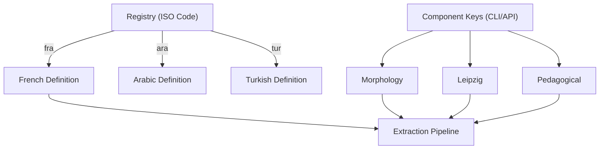

# Analysis Components

`AnalysisComponent` are the building blocks of extraction in Pāṇini. Each component is responsible for a specific analysis axis (Morphology, Pedagogical Explanation, Leipzig Glossing, etc.).

---

## 1. Role and Principles

A component is an isolated unit of work that:
1. **Defines its own data structure** JSON (via a schema).
2. **Provides its own instructions** to the AI (via a prompt fragment).
3. **Validates and cleans its own data** after extraction.

This modular approach allows you to ask the AI only for what you need, reducing costs and improving accuracy.



---

## 2. Usage

### Selecting Components (CLI)

By default, all components compatible with the target language are executed. You can restrict the selection with the `--components` flag:

```bash
# Execute only morphology and Leipzig glossing
panini extract --components morphology,leipzig_alignment \
  --text "Dał kotowi mleko." \
  --target "kotowi"
```

### Usage via API (Rust)

```rust
let result = registry::extract_erased_with_components(
    "pol", &model, &request,
    Some(&["morphology", "pedagogical_explanation"]),
    0.2, 4096, None, &prompts,
).await?;
```

---

## 3. Built-in Components

| Key | Struct | Description |
| :--- | :--- | :--- |
| `morphology` | `MorphologyAnalysis` | Full morphological analysis (POS, lemma, case, gender...). |
| `pedagogical_explanation` | `PedagogicalExplanation` | Structured HTML explanation for the learner. |
| `morpheme_segmentation` | `MorphemeSegmentation` | Morpheme segmentation (Agglutinative languages). |
| `multiword_expressions` | `MultiwordExpressions` | Detection of idioms and multi-word expressions. |
| `leipzig_alignment` | `LeipzigAlignment` | Interlinear glossing (Leipzig Rules). |

---

## 4. Consuming Results

The recommended way to consume results is through the `#[derive(PaniniResult)]` macro. It automatically maps JSON keys to your struct fields.

```rust
#[derive(PaniniResult)]
pub struct FullExtraction<L: LinguisticDefinition> {
    #[component(MorphologyAnalysis)]
    pub morphology: MorphologyResult<L::Morphology>,
    
    #[component(PedagogicalExplanation)]
    pub explanation: String,
}
```

!!! tip "Optional Results"
    If a component is optional (e.g., `MorphemeSegmentation`, which only runs on compatible languages), use `Option<T>` in your struct.
