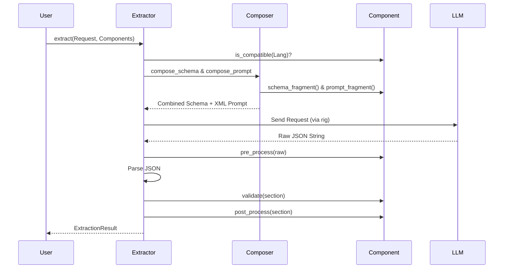
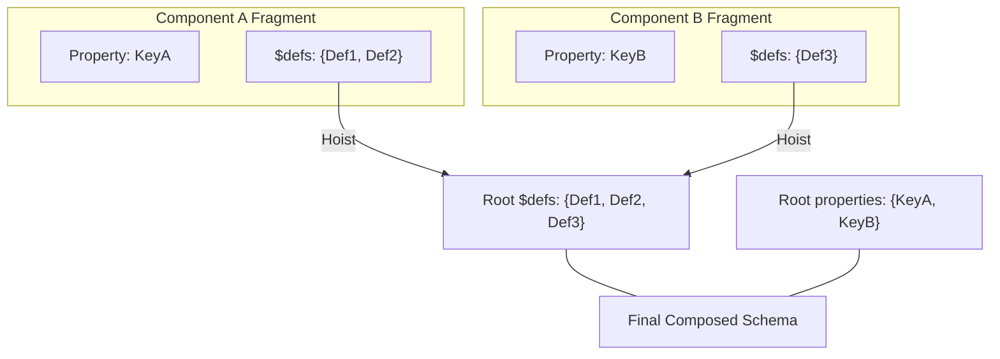

# Component Lifecycle

The Pāṇini extractor orchestrates the flow from the ISO code to the validated result. Understanding this cycle is essential for mastering LLM cleaning and validation.

---

## 🏗 Extraction Orchestration



---

## 🛠 Lifecycle Hooks

### 1. Pre-processing (`pre_process`)
Cleaning the raw JSON before parsing.

- **Usage**: Normalize POS tags from the LLM (e.g., `ADJ` -> `adjective`), remove stray characters.
- **Signature**: `fn pre_process(&self, raw: &str) -> String`

### 2. Validation (`validate`)
Semantic checking after parsing.

- **Usage**: Ensure a lemma isn't empty or that morphological categories are consistent.
- **Signature**: `fn validate(&self, lang: &L, section: &Value) -> Result<(), String>`

### 3. Post-processing (`post_process`)
Final mutation of the result before returning.

- **Usage**: Enrich the result with static data from a dictionary, or reformat a pedagogical explanation.
- **Signature**: `fn post_process(&self, lang: &L, section: &mut Value) -> Result<(), String>`

**Sample Output (Post-Processing Enrichment):**
```json
// Before validation/enrichment
{ "lemma": "studentka", "pos": "noun" }

// After post_process (dictionary lookup)
{ "lemma": "studentka", "pos": "noun", "translation": "female student" }
```

---

## 📦 Composition and Hoisting

When composing the schema, Pāṇini performs **$defs Hoisting**. This is crucial for validation.



!!! warning "Schema Validation"
    If your component uses complex structures with `$ref` references, ensure that the `$defs` definitions are present in the fragment. The framework will automatically hoist them to the root level for validation to work.
