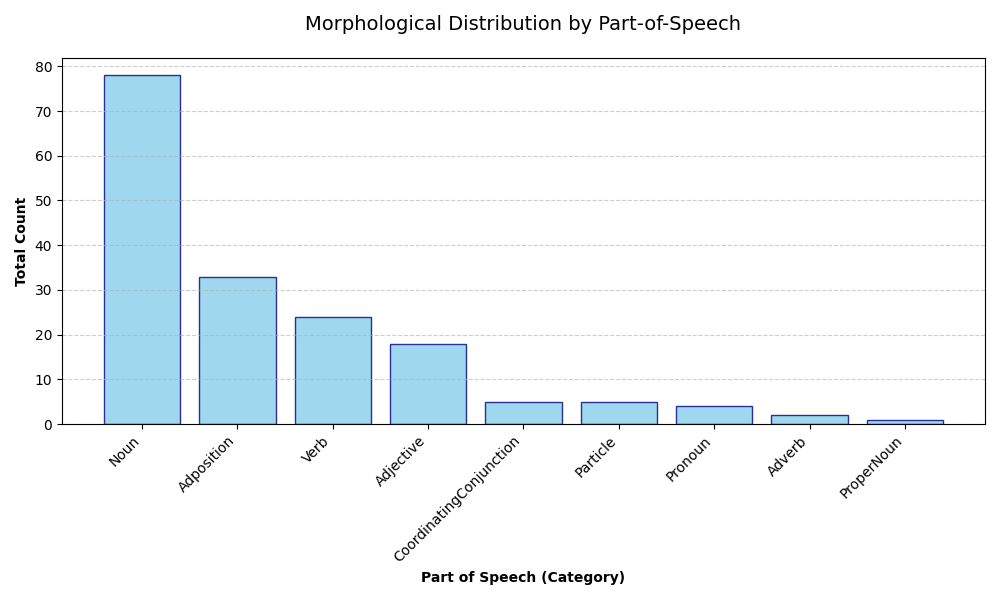
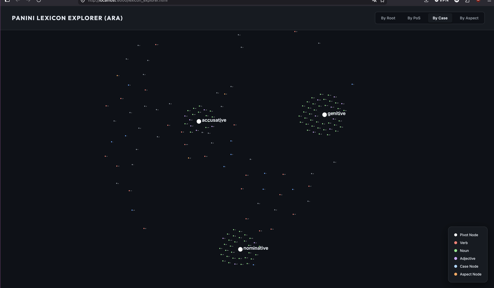
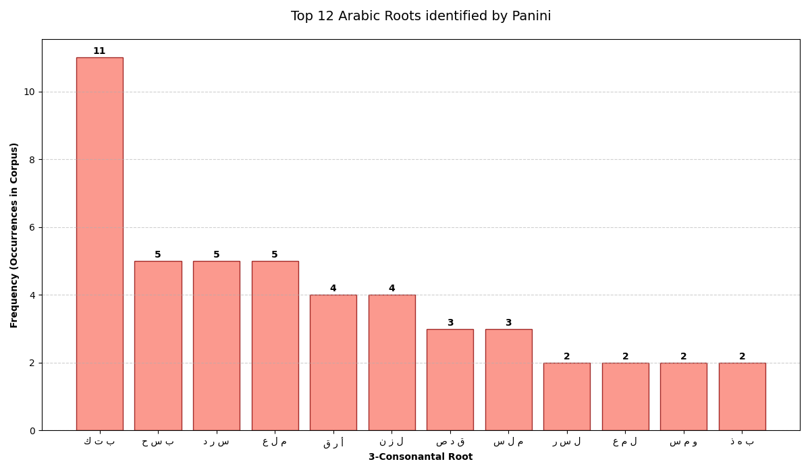

# Code Examples

Explore how Pāṇini handles real-world linguistic data across different languages and analysis modes.

## 🇹🇷 Turkish: Agglutinative Segmentation

### Key Concept: Morpheme Inventory
Turkish is a highly agglutinative language where a single word can contain multiple grammatical functions. Pāṇini uses an `Inventory` to match surface forms to grammatical meanings.

```python
# Example of Turkish segmentation
result = panini.extract(
    language="tur",
    text="gelmeyecekler",
    components=["morpheme_segmentation"]
)
```

**Output Example:**
*   Word: `gelmeyecekler`
    *   `gel` (Verb Root)
    *   `ma` (Negative)
    *   `y` (Buffer)
    *   `ecek` (Future)
    *   `ler` (3rd Person Plural)

---

## 🇦🇪 Arabic: Morphological Aggregation

The Arabic example showcases Pāṇini's ability to perform statistical analysis over a corpora, specifically focusing on the 3-consonantal root system.

### Pivoted Aggregation
In Semitic languages, verbs, nouns and adjectives can be constructed from a 3-consonantal root. For example, the root **k-t-b** (ك ت ب) related to "writing" generates: 
- **kataba** (كَتَبَ) — "he wrote" (verb)
- **kitāb** (كِتَاب) — "book" (noun)
- **kātib** (كَاتِب) — "writer" (noun)
- **maktaba** (مَكْتَبَة) — "library" (noun)

Therefore, for those languages, it is often useful to aggregate data *by root* rather than by word. Panini's `record_pivoted` allows you to define a "pivot" callback to group results dynamically.

```python
# Aggregate by root
aggregator.record_pivoted(
    lang_code="ara",
    result=extraction_result,
    pivot_callback=lambda feat: next(iter(feat.values())).get("root", "no-root")
)
```

---

## 📊 Visualizing Results

Pāṇini's aggregation data can be easily exported for visualization. Below are samples generated using the `helper.py` utility included in the examples.

### PoS Category Distribution
Understand the balance of nouns, verbs, and adjectives in your corpus.


### Case Distribution (Arabic)
Explore how case markers are used across the analyzed text.


### Root Frequency Analysis
Identify the most productive roots in your linguistic data.


---

## 🚀 Lexicon Explorer

For a truly immersive experience, the Python examples include a **Lexicon Explorer** dashboard built with D3.js.

- **Interactive Network**: View the relationships between roots and their lexical realizations.
- **Dynamic Pivoting**: Switch between views (Root, PoS, Case, Aspect) in real-time.
- **Deep Insight**: Hover over nodes to see the full morphological trait set.

> [!TIP]
> Run the Arabic aggregation example in the `examples/python` directory to generate your own `lexicon_data.json` and launch the dashboard!
