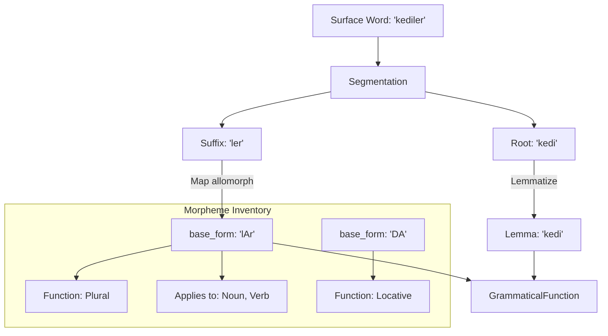

# Agglutinative Languages

For languages like Turkish, where words are formed by chaining morphemes, Pāṇini offers a specific architecture based on **Morpheme Extraction**.

!!! info "Linguistic Flexibility"
    The distinction between "agglutinative" and "fusional" / "inflectional" languages is often a spectrum rather than a binary choice. Pāṇini's morpheme extraction system can be implemented for any language where your analysis requires tokenizing internal word structures—even as a borderline case for languages like Armenian.

---

## 🏗 Agglutination Model

The Pāṇini model maps surface allomorphs to archiphonemic "base forms" (e.g., `-lar` and `-ler` to `lAr`) using a static inventory.



**Sample Segmentation Output (Turkish):**
```json
{
  "word": "kediler",
  "lemma": "kedi",
  "morphemes": [
    {
      "base_form": "lAr",
      "function": { "agreement": { "person": "third", "number": "plural" } }
    }
  ]
}
```

---

## 🛠 Implementation

### 1. GrammaticalFunction Enum
Unlike fusion languages, agglutinative languages define a `GrammaticalFunction` enum that describes the role of each morpheme.

```rust
#[derive(Debug, Clone, PartialEq, Serialize, Deserialize, schemars::JsonSchema, panini_macro::AggregableFields)]
pub enum TurkishGrammaticalFunction {
    Case { value: TurkishCase },
    Tense { value: TurkishTense },
    Agreement { person: Person, number: BinaryNumber },
    Possessive { person: Person, number: BinaryNumber },
    Derivation { value: TurkishDerivation },
}
```

### 2. Morpheme Inventory
Define a static list of `MorphemeDefinition`. These morphemes map archiphonemes to grammatical functions.

```rust
type P = TurkishMorphologyPosTag; // Generated by MorphologyInfo
type F = TurkishGrammaticalFunction;

static TURKISH_MORPHEMES: &[MorphemeDefinition<F, P>] = &[
    // Plural suffix: "lAr" is the archiphoneme (handles -lar and -ler)
    MorphemeDefinition { 
        base_form: "lAr", 
        functions: &[F::Agreement { person: Person::Third, number: BinaryNumber::Plural }], 
        applies_to: &[P::Noun, P::Verb, P::ProperNoun] 
    },
    // Case suffix: "(y)A" (handles -a and -e with linking consonant)
    MorphemeDefinition { 
        base_form: "(y)A", 
        functions: &[F::Case { value: TurkishCase::Dative }], 
        applies_to: &[P::Noun, P::Pronoun] 
    },
];
```

---

## 🤖 Interaction with the LLM

To help the AI know which morphemes to extract, Pāṇini dynamically injects your inventory into the prompt via `extra_extraction_directives()`.

!!! info "Dynamic Directives"
    By using `extra_extraction_directives()`, you ensure that the LLM only uses `base_forms` that your code can technically recognize.

---

## 🪄 Post-processing and Enrichment

Sometimes the LLM response needs additional verification or static label injection. Use `post_process_extraction` to modify the result after parsing.

```rust
impl LinguisticDefinition for Turkish {
    // ...
    fn post_process_extraction(
        &self,
        segmentation: &mut Option<Vec<WordSegmentation<Self::GrammaticalFunction>>>,
    ) -> Result<(), String> {
        if let Some(segs) = segmentation {
            for seg in segs {
                // Example: Automatically enrich morphemes
                for morph in &mut seg.morphemes {
                    if morph.base_form == "CI" {
                        // Agentive suffix "-cı/-ci/-cu/-cü"
                        // Custom enrichment logic here...
                    }
                }
            }
        }
        Ok(())
    }
}
```
