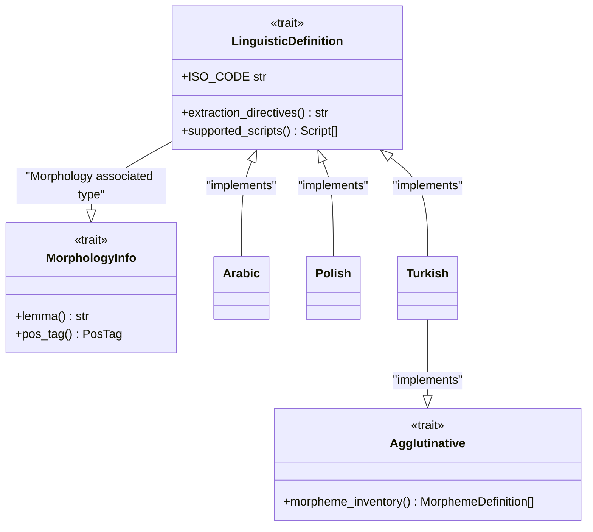
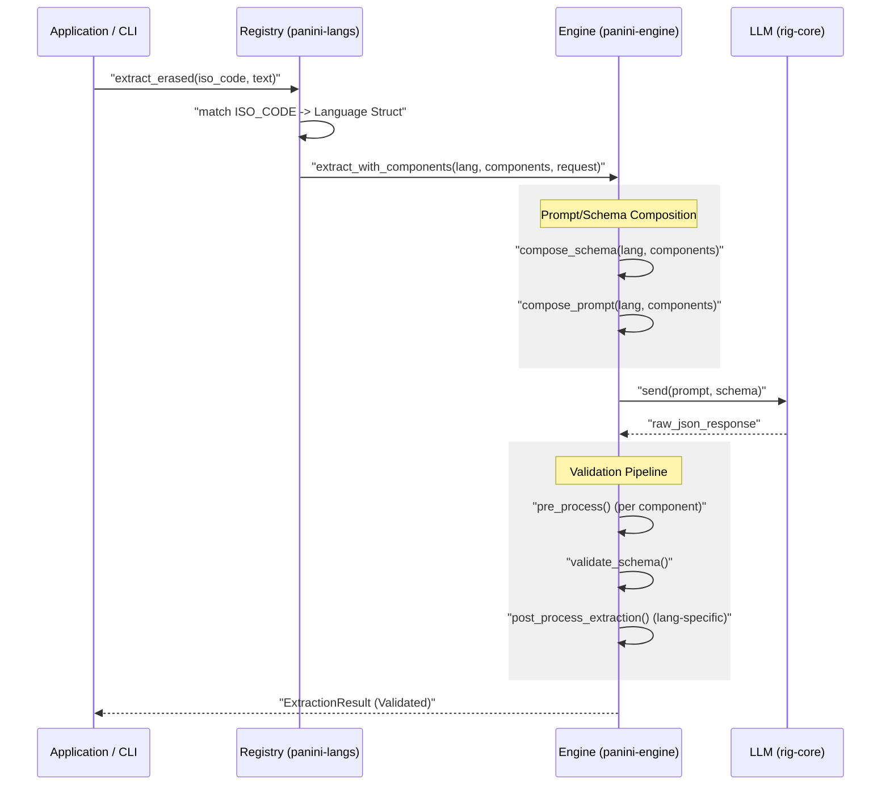

# Languages in Pāṇini

Pāṇini is built on the principle of **radical linguistic agnosticism**. Unlike other frameworks that impose a universal schema (e.g., always having `gender` or `case`), Pāṇini treats each language as a unique type system.

However, while extraction is language-specific, the **Aggregation** system allows you to condense and analyze this heterogeneous data into generic statistical reports, regardless of the target language's underlying schema.

## 1. Role of the Linguistic Definition

The role of a language definition in Pāṇini is threefold:
1. **Define the Data Schema**: What are the relevant morphological features (Case, Gender, Tense, Aspect, etc.)?
2. **Guide Extraction (Directives)**: How should the AI analyze this specific language?
3. **Validate Results**: Ensure the AI doesn't return non-existent categories for that language.

---

## 2. Model Architecture

The extraction lifecycle begins with identifying the language via its ISO 639-3 code (e.g., `pol` for Polish, `ara` for Arabic).

---

## 3. Usage: The Extraction Cycle

The Pāṇini orchestrator uses these definitions to dynamically build the prompt and JSON schema sent to the LLM.

## 4. Key Concepts

### No Universal Schema
In Arabic, we focus on triliteral roots and verb forms (Wazn). In Polish, we focus on 7 cases and verbal aspect. In Pāṇini, these two worlds coexist via distinct Rust enums.

### Linguistic Directives
Each language has its own `extraction_directives()`. These are natural-language instructions that explain language nuances (e.g., how to distinguish two close prepositions or how to handle archaic forms).

### Scripts and ISO Codes

Pāṇini uses international standards to ensure robustness:

- **ISO 639-3**: For language identification (e.g., `pol`, `ara`, `tur`).
- **ISO 15924**: For script management (Latin, Arabic, Cyrillic, etc.).
