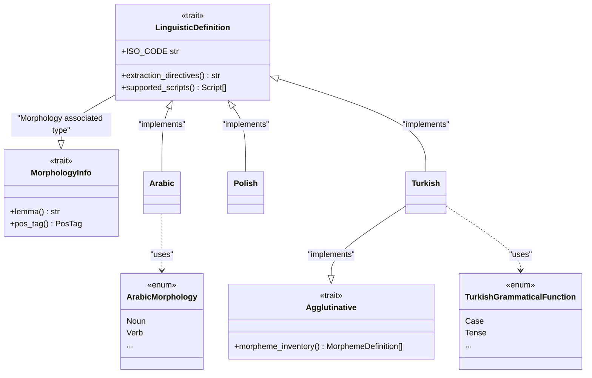
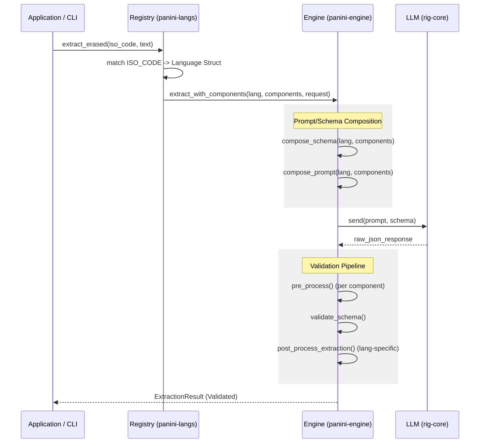
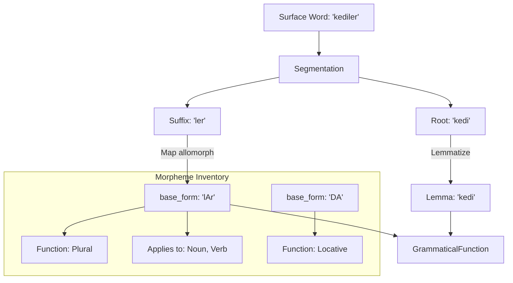

# Panini Language System: Infrastructure & Implementation Guide

This document provides a technical overview of how languages are defined and integrated into the Panini framework. It covers the core traits, procedural macros, and the registration system for morphological extraction.

---

---

## 1. File Map: Where to find things

| Concept | Location | Purpose |
| :--- | :--- | :--- |
| **Core Traits** | `panini-core/src/traits.rs` | Definitions of `LinguisticDefinition` and `MorphologyInfo`. |
| **Agglutination Logic** | `panini-core/src/morpheme.rs` | Definitions of `Agglutinative` and `MorphemeDefinition`. |
| **Language Registry** | `panini-langs/src/registry.rs` | The `generate_registry!` macro and erased extraction entry point. |
| **Macros** | `panini-macro/src/` | Derives for `ClosedValues`, `MorphologyInfo`, and `AggregableFields`. |
| **Implementations** | `panini-langs/src/` | Specific files (e.g., `arabic.rs`, `polish.rs`, `turkish.rs`). |

---

## 2. Architecture Overview

The following diagram illustrates the relationship between the core traits and the language-specific implementations.



---

## 3. Extraction Lifecycle

The Panini engine orchestrates the flow from an ISO code to a validated `ExtractionResult`.



---

## 4. Agglutination Model

For languages like Turkish, the model maps surface allomorphs back to archiphonemic base forms using a static inventory.



---

## 5. Anatomy of a Language Definition

A language implementation in Panini consists of four main parts:

### Part A: Feature Enums
Use `ClosedValues` for any field that has a finite set of possibilities (e.g., Case, Tense, Mood). This allows the Aggregator to calculate **Coverage**.

> [!TIP]
> **Reuse Shared Enums**
> Check `panini-core/src/morphology_enums.rs` for common linguistic categories like `Person`, `BinaryNumber`, `TernaryGender`, `SlavicAspect`, etc. Use these instead of redefining them locally when possible.

```rust
// Language-specific enum
#[derive(Debug, Clone, Copy, PartialEq, Eq, Hash, Serialize, Deserialize, schemars::JsonSchema, panini_macro::ClosedValues)]
#[serde(rename_all = "snake_case")]
pub enum PolishCase {
    Nominative, Genitive, Dative, Accusative, Instrumental, Locative, Vocative,
}

// Reusing shared enums
use panini_core::traits::{BinaryNumber, TernaryGender, SlavicAspect};
```

### Part B: The Morphology Enum
The `Morphology` enum defines the available Part-of-Speech (PoS) categories. Derive `MorphologyInfo` to automatically generate `PosTag` enums and lemma getters.

```rust
#[derive(Debug, Clone, PartialEq, Eq, Hash, Serialize, Deserialize, schemars::JsonSchema, panini_macro::MorphologyInfo)]
#[serde(tag = "pos", rename_all = "snake_case")]
pub enum PolishMorphology {
    Noun {
        lemma: String,
        gender: PolishGender, // Local custom enum
        number: BinaryNumber, // Shared enum
        case: PolishCase,     // Local custom enum
    },
    Verb {
        lemma: String,
        aspect: SlavicAspect, // Shared enum
        tense: PolishTense,
        person: Person,       // Shared enum
    },
    Adjective {
        lemma: String,
        gender: PolishGender,
        case: PolishCase,
        number: BinaryNumber,
        degree: PolishDegree,
    },
    Other { lemma: String },
}
```

### Part C: The Language Struct
A unit struct that implements `LinguisticDefinition`. This captures the "identity" and "extraction logic" of the language.

```rust
pub struct Polish;

impl LinguisticDefinition for Polish {
    type Morphology = PolishMorphology;
    type GrammaticalFunction = (); // Non-agglutinative

    const ISO_CODE: &'static str = "pol";

    fn supported_scripts(&self) -> &[Script] {
        &[Script::LATN]
    }

    fn default_script(&self) -> Script {
        Script::LATN
    }

    fn typological_features(&self) -> &[TypologicalFeature] {
        &[TypologicalFeature::Conjugation]
    }

    fn extraction_directives(&self) -> &str {
        "1. Extraction: Provide lemma, POS, and all morphological features.\n\
         2. Case naming: Use standard Polish case names (nominative, etc.).\n\
         3. Aspect: Distinguish between perfective and imperfective verbs."
    }
}
```

---

## 3. Special Case: Agglutinative Languages (Turkish)

For languages where words are built by chaining morphemes, you must implement the `Agglutinative` trait and define a `GrammaticalFunction` wrapper.

### 1. GrammaticalFunction Enum
This enum represents the "meaning" of individual suffixes. Use `AggregableFields` to enable automatic breakdown in reports.

```rust
#[derive(Debug, Clone, PartialEq, Serialize, Deserialize, schemars::JsonSchema, panini_macro::AggregableFields)]
#[serde(tag = "category", rename_all = "snake_case")]
pub enum TurkishGrammaticalFunction {
    Case { value: TurkishCase },
    Tense { value: TurkishTense },
    Agreement { person: Person, number: BinaryNumber },
    Possessive { person: Person, number: BinaryNumber },
    Derivation { value: TurkishDerivation },
}
```

### 2. Morpheme Inventory
Define a static list of morphemes. The `ExtractionResult` will contain these `base_forms` when the LLM segments a word.

```rust
type P = TurkishMorphologyPosTag; // Generated by MorphologyInfo
type F = TurkishGrammaticalFunction;

static TURKISH_MORPHEMES: &[MorphemeDefinition<F, P>] = &[
    // Plural suffix: "lAr" is the archiphoneme (handles -lar and -ler)
    MorphemeDefinition { 
        base_form: "lAr", 
        functions: &[F::Agreement { person: Person::Third, number: BinaryNumber::Plural }], 
        applies_to: &[P::Noun, P::Verb, P::ProperNoun] 
    },
    // Case suffix: "(y)A" (handles -a and -e)
    MorphemeDefinition { 
        base_form: "(y)A", 
        functions: &[F::Case { value: TurkishCase::Dative }], 
        applies_to: &[P::Noun, P::Pronoun] 
    },
];
```

---

## 4. Post-processing & Enrichment

Sometimes the LLM response needs verification or static injection (e.g., adding labels that aren't in the surface form). Use `post_process_extraction`.

```rust
impl LinguisticDefinition for Turkish {
    // ...
    fn post_process_extraction(
        &self,
        segmentation: &mut Option<Vec<WordSegmentation<Self::GrammaticalFunction>>>,
    ) -> Result<(), String> {
        if let Some(segs) = segmentation {
            for seg in segs {
                // Example: Automatically enrich specific morpheme mappings
                for morph in &mut seg.morphemes {
                    if morph.base_form == "CI" {
                        // Suffix "-cı/-ci/-cu/-cü" (Agentive)
                        // Custom enrichment logic here...
                    }
                }
            }
        }
        Ok(())
    }
}
```

---

## 5. Interaction with the LLM (Directives)

The `extraction_directives()` method is the most critical part of the definition. It provides the "prompt fragments" that tell the LLM how to analyze the language.

> [!TIP]
> **Dynamic Directives**
> In agglutinative languages, use `extra_extraction_directives()` to inject the morpheme inventory dynamically into the prompt. This ensures the LLM only uses `base_forms` that your code can recognize.

---

## 6. Registration & Dispatch

To make a language usable by the CLI or API, it must be registered in the `generate_registry!` macro in `panini-langs/src/registry.rs`.

```rust
// panini-langs/src/registry.rs

use crate::{Arabic, French, Italian, Polish, Turkish};

generate_registry!(Polish, Turkish, Arabic, French, Italian);
```

This macro generates:
1. `extract_erased_with_components`: The unified entry point used by the `panini` CLI.
2. `supported_languages()`: A function returning `&["pol", "tur", "ara", "fra", "ita"]`.

---

## 6. Verification & Testing

### Unit Tests
Verify component compatibility in `panini-langs/src/registry.rs`:
```rust
#[test]
fn morpheme_segmentation_compatible_with_turkish() {
    let comp = MorphemeSegmentation;
    assert!(comp.is_compatible(&Turkish));
}
```

### Manual CLI Validation
Once your language is registered, you can test it directly:
```bash
# Verify the lexicon report (uses the registry dispatch)
cargo run --bin lexicon-debug -- --language ara
```

---

## 7. Future Considerations & Upcoming Patterns

The following patterns are planned or under consideration for upcoming language support:

*   **Japanese (Honorifics & Scripts)**: Will require multi-script support (Hiragana/Katakana/Kanji) and a dedicated honorifics feature level.
*   **Mandarin (Isolating Model)**: Focus on measure words, aspect particles, and syntax-driven morphology rather than inflection.
*   **Russian (Shared Slavic Traits)**: Implementation of shared traits (e.g. `SlavicAspect`) to minimize duplication between Polish and Russian.
*   **Semitic Roots (Root/Pattern)**: Potential formalization of the `root` + `pattern` relationship to enable validation of derived forms.

---

> [!IMPORTANT]
> **Open vs. Closed Sets**
> Always prefer `ClosedValues` enums for grammatical features. If a field is a `String` (like `lemma`), the aggregator treats it as an "Open" set and can only track counts, not coverage.
