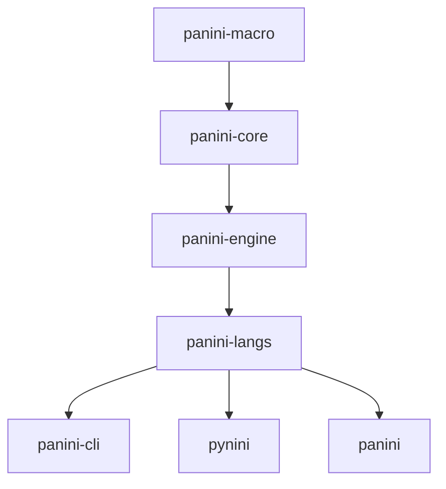
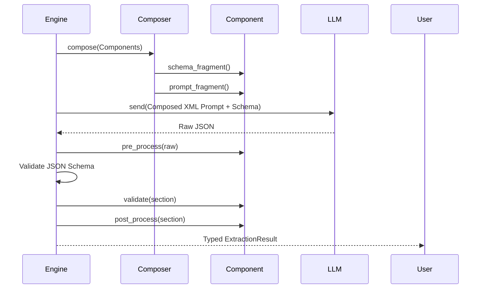

# Panini Rust Framework: Architectural & Implementation Guide

This document is the definitive technical reference for developers working on the Panini core, adding new languages, or extending the extraction pipeline in Rust.

---

## 1. Workspace Architecture

Panini is organized as a 7-crate Cargo workspace with a strict, unidirectional dependency flow.



### Crate Roles & Responsibilities

| Crate | Responsibility | Key Files |
| :--- | :--- | :--- |
| `panini-macro` | Proc-macro derivations. | `morphology_info.rs`, `panini_result.rs` |
| `panini-core` | Traits, shared enums, and built-in components. | `traits.rs`, `component.rs`, `morphology_enums.rs` |
| `panini-engine` | LLM orchestration and pipeline entry points. | `extractor.rs`, `composer.rs`, `prompts.rs` |
| `panini-langs` | Language implementations and registry dispatch. | `registry.rs`, `arabic.rs`, `french.rs`, etc. |

---

## 2. Core Traits: Modeling Language

The framework relies on four primary traits to bridge linguistic theory with Rust's type system.

### `LinguisticDefinition`
Defines the "Identity" of a language.

```rust
pub struct French;

impl LinguisticDefinition for French {
    type Morphology = FrenchMorphology;
    type GrammaticalFunction = (); // Non-agglutinative
    const ISO_CODE: &'static str = "fra";

    fn supported_scripts(&self) -> &[Script] { &[Script::LATN] }
    fn default_script(&self) -> Script { Script::LATN }
    fn extraction_directives(&self) -> &str {
        "1. Lemmatize to masculine singular.\n2. Identify clitics (l', j')."
    }
}
```

### `AnalysisComponent<L>`
Defines a composable analysis unit.

```rust
#[derive(Debug, Default)]
pub struct CefrComplexity;

impl<L: LinguisticDefinition> AnalysisComponent<L> for CefrComplexity {
    fn name(&self) -> &'static str { "CEFR Complexity" }
    fn schema_key(&self) -> &'static str { "complexity" }

    fn schema_fragment(&self, _lang: &L) -> serde_json::Value {
        serde_json::json!({
            "type": "string",
            "enum": ["A1", "A2", "B1", "B2", "C1", "C2"]
        })
    }

    fn prompt_fragment(&self, _lang: &L, _ctx: &ComponentContext) -> String {
        "Analyze the sentence grammar to determine its CEFR level.".to_string()
    }
}
```

---

## 3. Procedural Macros & Type Safety

Macros enforce Panini's "Radical Agnosticism" while guaranteeing runtime stability.

### `#[derive(MorphologyInfo)]`
Ensures every Part-of-Speech variant has a `lemma`.

```rust
#[derive(Debug, Clone, Serialize, Deserialize, JsonSchema, panini_macro::MorphologyInfo)]
#[serde(tag = "pos", rename_all = "snake_case")]
pub enum PolishMorphology {
    Noun {
        lemma: String,
        gender: PolishGender,
        number: BinaryNumber, // Shared enum
    },
    Verb {
        lemma: String,
        aspect: SlavicAspect, // Shared enum
        tense: PolishTense,
    },
}
```

> [!IMPORTANT]
> **Compilation Check**
> If you add a variant `Other { text: String }` without a `lemma` field, the code will **fail to compile** with a clear error from the macro.

### `#[derive(PaniniResult)]`
Generates a type-safe extraction interface.

```rust
#[derive(PaniniResult)]
pub struct FullExtraction<L: LinguisticDefinition> {
    #[component(MorphologyAnalysis)]
    pub morphology: MorphologyResult<L::Morphology>,
    
    #[component(CefrComplexity)]
    pub complexity: String,
}

// Usage:
let res: FullExtraction<French> = FullExtraction::extract(&lang, &model, &req, opts).await?;
println!("Level: {}", res.complexity);
```

---

## 4. The Extraction Lifecycle

Panini uses a multi-stage pipeline to ensure LLM outputs are valid.



### Prompt Orchestration (XML Isolation)
The `composer.rs` wraps instructions in tags to help the LLM stay focused:

```xml
<target_language>French</target_language>
<complexity>
Analyze the sentence grammar to determine its CEFR level.
</complexity>
<output>
Return a JSON object matching the schema.
</output>
```

---

## 5. Error Handling & Self-Correction

Panini treats the LLM as an untrusted source, using a retry loop for failures.

```rust
let mut attempt = 0;
let mut prev_attempt = None;

while attempt < 3 {
    let opts = ExtractionOptions {
        previous_attempt: prev_attempt.as_ref(),
        ..default_opts
    };

    match FullExtraction::extract(&lang, &model, &req, opts).await {
        Ok(res) => return Ok(res),
        Err(ExtractionError::Parse(e)) => {
            // Log warning and retry with the error context
            tracing::warn!("Retry attempt {}: {}", attempt, e.error_message);
            prev_attempt = Some(PreviousAttempt {
                raw_response: e.raw_response,
                error: e.error_message,
            });
            attempt += 1;
        }
        Err(e) => return Err(e), // Fatal error
    }
}
```

---

## 6. Development Guidelines

### 1. The Semantic Bijection Principle
Only put enums in `panini-core/src/morphology_enums.rs` if they mean exactly the same thing in every language.
*   **YES**: `Person::First`, `BinaryNumber::Plural`.
*   **NO**: `Tense::Future` (Modern Greek "Future" is morphologically distinct from French "Future").

### 2. $defs Hoisting
If your `AnalysisComponent` uses complex nested types, `schemars` will generate `$defs`. The `composer.rs` automatically hoists these to the root level. Ensure your `schema_fragment` generates a valid `RootSchema`.

```rust
fn schema_fragment(&self, _lang: &L) -> serde_json::Value {
    let gen = schemars::SchemaGenerator::default();
    let schema = gen.into_root_schema_for::<MyComplexType>();
    serde_json::to_value(&schema).unwrap()
}
```

---

> [!TIP]
> **Performance**
> Avoid calling `ExtractionResult::get()` inside a loop. If you need to transform the data, do it in the `post_process` hook of your component or use a `PaniniResult` struct to deserialize everything in a single pass.
